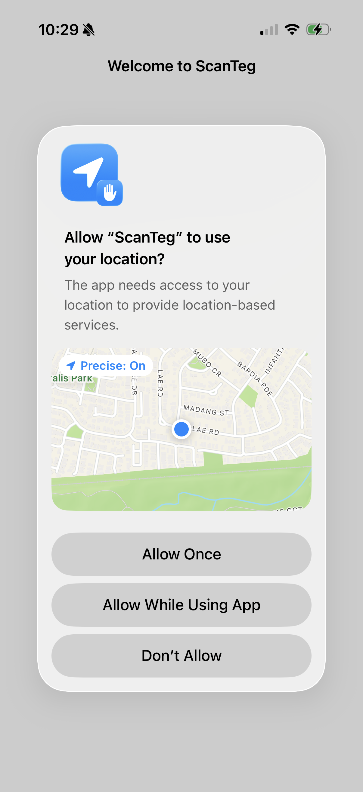
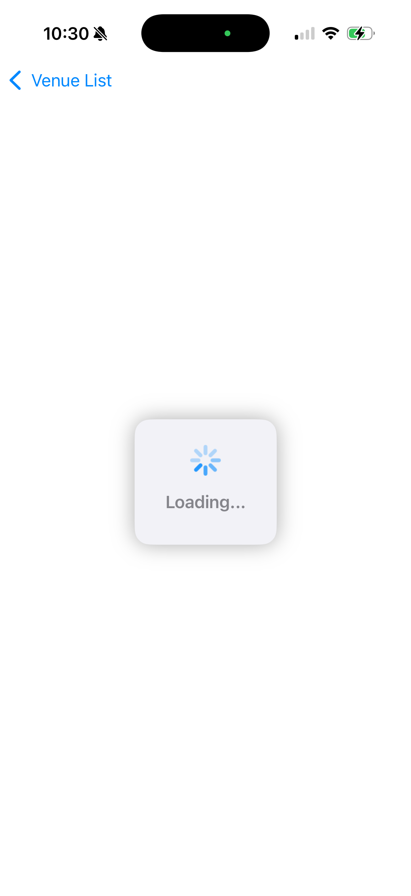
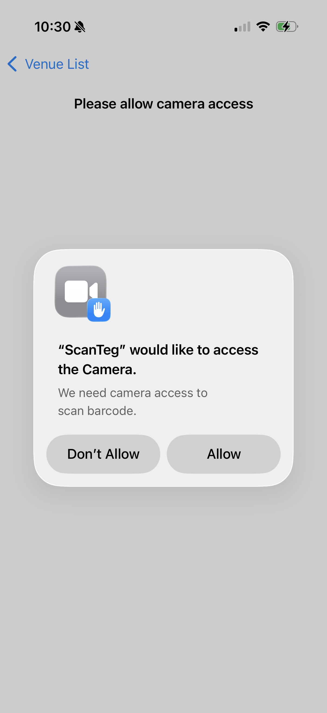

### This is code challenge App
- IDE version: Xcode 16.1
- Deployment target: iOS 16.0
- Used MVVM Architecture

### How to test
- Clone the repo and run in physical device since it uses camera for barcode scanning.

### Screenshots
- Look inside the [screenShot folder]([https://pages.github.com/](https://github.com/jithinpala/ScanTeg/tree/main/ScanTeg/screenShots))

| Feature | Screenshot 
|---------|-----------|
| **Splash screen** |  |
| **Location permission** |  |
| **Loading screen** |  |
| **Venue list** |  |
| **Camera access permission** |  |
| **Camera view** |  |
| **Barcode reader success** |  |
